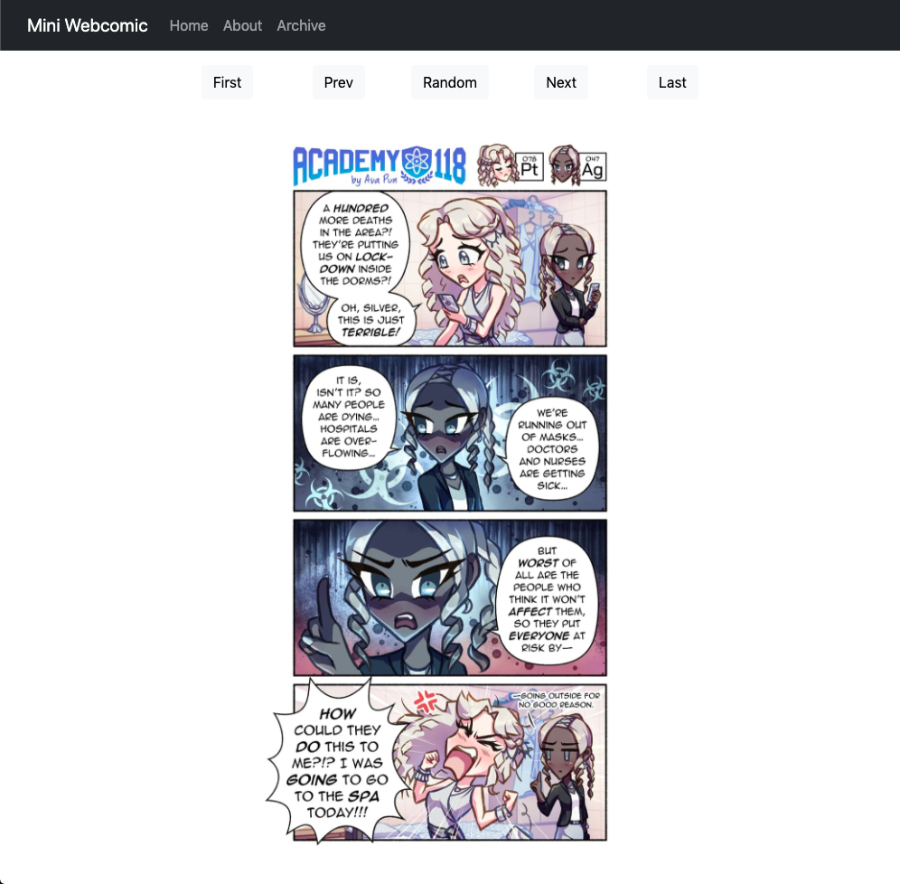
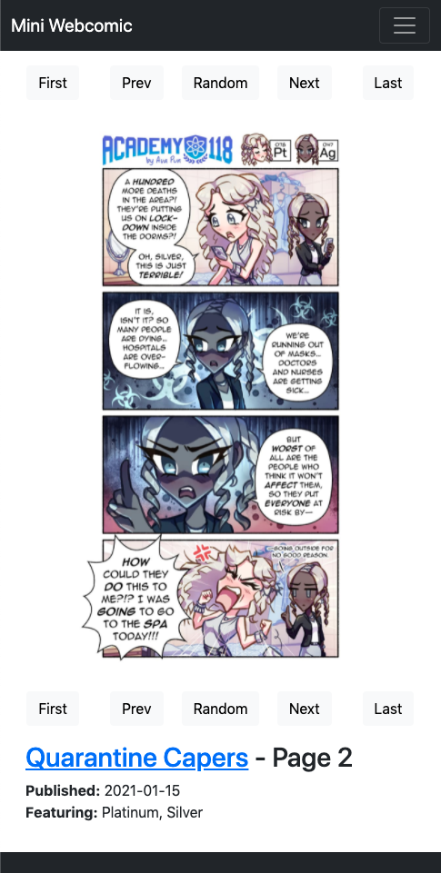

# mini-webcomic

**UPDATE 2023/12/09: A new, _database-free_ version of mini-webcomic is now available [here](https://github.com/AvaLovelace1/mini-hugo-webcomic)!**

A minimalistic, responsive webcomic template created for my comic, *[Academy 118](https://academy118.com)*.

 

## Installation
Make sure you have the latest versions of PHP and MariaDB/MySQL installed. Place this folder into the root directory of your webserver. Change the `username` and `password` fields in `php/database` to your MySQL user and password.

The comics database is dumped in `miniwebcomic.sql`. Restore it by running:
```
mysql -u[user] -p[password] miniwebcomic < miniwebcomic.sql
```

## Usage

Comics are organized by episode; each episode can contain one or more comic pages.

New comic pages and episodes can be added by `INSERT`ing rows into the `comics` and `episodes` tables in the `miniwebcomic` database. Comics will auto-publish based on the given `publish_date`.

Comic image files are stored in `comics`. Image filenames follow the format `[filename]_[pageNumber].[extension]`. The `pageNumber` must be padded with leading zeros to a length of 3.
